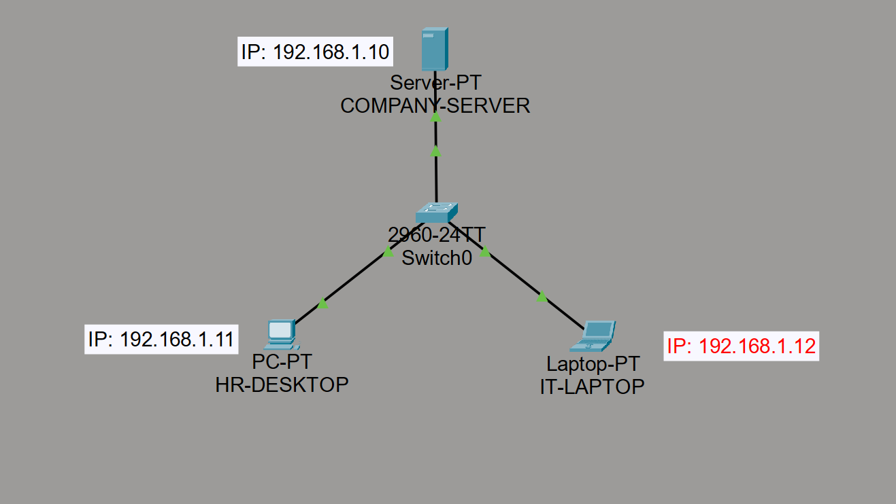

# Secure SOHO Network with Wireless Architecture & Web Hosting

## Objective
To expand a basic local area network into a hybrid SOHO (Small Office/Home Office) infrastructure, integrating dynamic wireless access clients and configuring a secure local HTTP intranet web server.

## Network Topology

## 1. Expanded Hardware Inventory
* **1 x Cisco Catalyst 2960 Switch:** Central core distributing data frames across the wired infrastructure ports.
* **1 x Linksys WRT300N Wireless Router:** Configured as a local access point providing automatic DHCP IP allocation to roaming wireless clients.
* **1 x Enterprise Data Server (COMPANY-SERVER):** Reconfigured to host a secure, internal HTTP/HTTPS web application server.
* **2 x Wired Workstations (HR-DESKTOP & IT-LAPTOP):** Stationary corporate nodes utilizing static IPv4 assignments for administrative access.
* **2 x Wireless End Devices (Smartphone0 & Wireless-Laptop1):** A roaming smartphone and a mobile laptop fitted with a wireless network interface card (NIC), communicating via IEEE 802.11 wireless protocols.

## 2. Updated Addressing Matrix
Wired components operate on static addressing, while mobile clients utilize the wireless gateway's automated DHCP pool (`192.168.0.X`).

| Device Name | Connection Type | IP Address | Subnet Mask | Gateway / Mode |
| :--- | :--- | :--- | :--- | :--- |
| **COMPANY-SERVER** | Wired (Fa0/3) | `192.168.1.10` | `255.255.255.0` | Static |
| **HR-DESKTOP** | Wired (Fa0/1) | `192.168.1.11` | `255.255.255.0` | Static |
| **IT-LAPTOP** | Wired (Fa0/2) | `192.168.1.12` | `255.255.255.0` | Static |
| **Wireless Router0**| Wired (Fa0/4) | DHCP Assigned | `255.255.255.0` | Dynamic |
| **Smartphone0** | Wireless | DHCP Assigned | `255.255.255.0` | `192.168.0.1` |
| **Wireless-Laptop1**| Wireless | DHCP Assigned | `255.255.255.0` | `192.168.0.1` |

## 3. Advanced Services Verification
* **HTTP Web Services:** An internal corporate portal with customized CSS styling was deployed directly within the server daemon. End-to-end routing was confirmed by successfully requesting the node via web browsers from different network stations.
* **Dynamic Addressing (DHCP):** Wireless clients automatically negotiated leases from the gateway node, confirming optimal DHCP allocation and wireless signal distribution.
