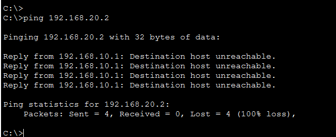
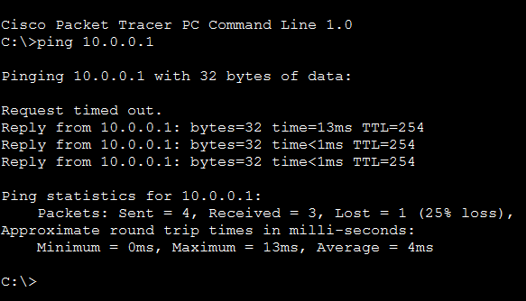
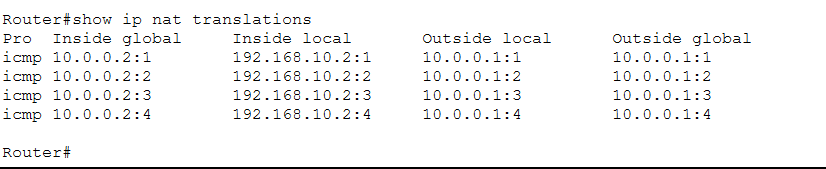

# Cisco Packet Tracer Networking Labs

A structured collection of hands-on networking labs built in Cisco Packet Tracer while studying Computer Networking (AAS pathway). The progression demonstrates foundational to intermediate enterprise networking skills including switching, routing, VLAN segmentation, inter-VLAN routing, security enforcement, and NAT/PAT implementation.

Each lab emphasizes three core skills:
- Correct configuration of Cisco IOS features
- Verification using show commands and ICMP testing
- Root-cause troubleshooting and correction of real configuration issues

---

## How to Use

- Install Cisco Packet Tracer (compatible version 8.x recommended)
- Clone or download this repository
- Open `.pkt` files from the `labs/` directory
- Review topology images and CLI configurations per lab

---

## Lab Progression

| Lab Project | Concepts Covered | Date Completed | Topology |
| :--- | :--- | :--- |
| **Basic LAN** | Static IP Addressing, Layer 2 Switching Fundamentals | June 2026 | [View](images/basic-lan-topology.png) |
| **Secure SOHO** | Wireless Networking, DHCP Services | June 2026 | [View](images/secure-soho-topology.png) |
| **Enterprise Gateway** | Default Gateway Design, Layer 3 Routing Fundamentals | June 2026 | [View](images/enterprise-gateway-topology.png) |
| **Enterprise LAN/WAN** | ISP Connectivity, Static Routing, WAN Design | June 2026 | [View](images/enterprise-lan-wan-topology.png) |
| **VLAN & Inter-VLAN Routing (ROAS)** | VLAN Segmentation, 802.1Q Trunking, Router-on-a-Stick | June 2026 | [View](images/roas-topology.png) |
| **Access Control Lists (ACLs)** | Extended ACLs, Packet Filtering, Network Security Boundaries | June 2026 | [View](images/acl-topology.png) |
| **Dynamic NAT / PAT** | NAT Overload, IPv4 Address Translation, Public/Private Boundaries | June 2026 | [View](images/nat-topology.png) |

---

# Lab Spotlight: Enterprise LAN/WAN

## Overview
This lab connects a private enterprise LAN to an ISP network using a routed WAN link. It demonstrates static routing, default gateway design, and return-path routing requirements for full bidirectional connectivity.

## Technologies Used
- Layer 2 Switching (LAN segmentation)
- Layer 3 Routing (static routing, default route)
- WAN transit subnet design
- IPv4 subnetting and addressing
- ICMP connectivity testing and validation

## Network Design Summary
The enterprise LAN uses a private IPv4 network (192.168.1.0/24) connected to an edge router. The edge router forwards traffic to an ISP router via a WAN transit network. A default route is configured on the edge router to direct non-local traffic outward.

Bidirectional communication requires proper return routing from the ISP back to the internal network.

## Troubleshooting Log

### Issue
Internal hosts were unable to reach external ISP resources using ICMP.

### Root Cause
The ISP router did not have a return route to the internal 192.168.1.0/24 network. This created asymmetric routing, where outbound traffic succeeded but return traffic was dropped.

### Resolution
A static route was added on the ISP router:

ip route 192.168.1.0 255.255.255.0 10.0.0.2

This restored proper bidirectional routing between the ISP and enterprise network.

## Verification

### EDGE ROUTER
- Interface Status  
    
  All LAN and WAN interfaces are operational and correctly addressed.

- Routing Table  
    
  Default route (S*) correctly points toward ISP gateway.

### ISP ROUTER
- Interface Status  
    
  WAN and transit interfaces are operational.

- Routing Table  
    
  Static return route installed for 192.168.1.0/24 network.

## Key Takeaway
Always verify return-path routing when testing connectivity across networks—outbound reachability does not guarantee bidirectional communication.

---

# Lab Spotlight: VLAN Segmentation & Inter-VLAN Routing (ROAS)

## Overview
This lab implements VLAN segmentation to isolate departmental broadcast domains (HR, IT, Server). Inter-VLAN routing is enabled using Router-on-a-Stick (ROAS) with 802.1Q trunking and router sub-interfaces.

## Technologies Used
- VLAN segmentation (VLAN 10, 20, 30)
- IEEE 802.1Q trunking
- Router-on-a-Stick (ROAS)
- Inter-VLAN routing
- ARP resolution across VLAN boundaries

## Network Design Summary
A single Layer 2 switch separates traffic into VLANs for HR, IT, and Server departments. A trunk link connects the switch to a router, which performs inter-VLAN routing using logical sub-interfaces.

## Troubleshooting Log

### Issue 1: Trunk link not forming
- `show interface trunk` returned no active trunk
- Switch-to-router link remained down

#### Root Cause
Router physical interface was administratively down by default, preventing trunk negotiation.

#### Resolution
Enabled interface:

no shutdown

---

### Issue 2: Sub-interface configuration failure
- Error: invalid interface type/number

#### Root Cause
Incorrect interface naming was used (platform-specific IOS used GigabitEthernet0/0/0 instead of expected format).

#### Resolution
Verified interface structure using:

show ip interface brief

Then configured sub-interfaces under correct physical interface.

---

## Verification

### CORE SWITCH
- Trunk Port Status  
  GigabitEthernet0/1 operating as an active 802.1Q trunk carrying VLANs 10, 20, and 30.

### EDGE ROUTER
- Routing Table  
  Sub-interfaces (G0/0/0.10, .20, .30) installed as directly connected networks.

## Connectivity Testing

- HR (192.168.10.2) → IT (192.168.20.2): Success  
- HR (192.168.10.2) → Server (192.168.30.10): Success  
- IT (192.168.20.2) → Server (192.168.30.10): Success  

Initial ARP resolution delays were observed, followed by stable ICMP connectivity.

## Key Takeaway
Always verify physical interface state and platform-specific interface naming before configuring ROAS sub-interfaces.

---

# Lab Spotlight: Access Control Lists (ACLs) & Network Security

## Overview
This lab implements Layer 3 security using an Extended ACL to enforce departmental communication rules while preserving access to shared services.

## Technologies Used
- Extended ACL design and implementation
- Layer 3 packet filtering
- Security policy enforcement
- Wildcard masking logic
- Least-privilege network design

## Security Policy
- HR (VLAN 10) is denied access to IT (VLAN 20)
- HR is permitted access to Server network (VLAN 30)
- All other traffic is permitted by default

## ACL Implementation

Applied inbound on HR gateway interface:

access-list 5 deny ip 192.168.10.0 0.0.0.255 192.168.20.0 0.0.0.255  
access-list 5 permit ip any any  

## Troubleshooting Log

### Issue
HR devices were still able to reach IT subnet after ACL deployment.

### Root Cause
Incorrect wildcard mask usage (standard subnet mask used instead of inverse wildcard mask), causing ACL mismatch and ineffective filtering.

### Resolution
Correct wildcard mask:

0.0.0.255

ACL rebuilt and applied successfully.

## Verification

### Test 1: HR → IT (Blocked)
Source: 192.168.10.2 → 192.168.20.2  
Result: Blocked (expected behavior)

### Test 2: HR → Server (Allowed)
Result: Successful ICMP connectivity

### Test 3: IT → Server (Allowed)
Result: Successful ICMP connectivity

## Key Takeaway
ACL behavior is strictly dependent on wildcard mask logic—small syntax errors can completely invalidate security policy enforcement.

---

# Lab Spotlight: Dynamic NAT / PAT

## Overview
This lab implements NAT Overload (PAT) to allow multiple internal VLANs to share a single public IPv4 address. This demonstrates IPv4 conservation and real-world enterprise edge translation behavior.

## Technologies Used
- NAT (Network Address Translation)
- PAT (Port Address Translation / overload)
- Inside/Outside NAT interface design
- IPv4 public/private boundary handling
- Transport-layer port tracking

## Network Design Summary
Internal VLAN sub-interfaces are configured as NAT inside interfaces, while the WAN interface is configured as NAT outside. Traffic from private networks is translated dynamically to a single public IP using port-level differentiation.

## Implementation

interface gig0/0/0.10  
 ip nat inside  
interface gig0/0/0.20  
 ip nat inside  
interface gig0/0/0.30  
 ip nat inside  

interface gig0/0/0.1  
 ip nat outside  

access-list 5 permit 192.168.10.0 0.0.0.255  
access-list 5 permit 192.168.20.0 0.0.0.255  

ip nat inside source list 5 interface gig0/0/0.1 overload  

## Verification

### Connectivity Test
HR workstation successfully reached external ISP gateway after NAT translation.

---

### NAT Translation Table
Command:

show ip nat translations

Verified multiple internal hosts sharing a single public IP via unique port mappings.

## Key Takeaway
PAT enables scalable outbound connectivity by combining IP address translation with transport-layer port tracking.

---

# Planned Labs

- [x] Basic LAN  
- [x] Secure SOHO  
- [x] Enterprise Gateway  
- [x] Enterprise LAN/WAN  
- [x] VLAN Segmentation & ROAS  
- [x] ACLs  
- [x] NAT / PAT  
- [ ] OSPF Routing  
- [ ] Port Security  
